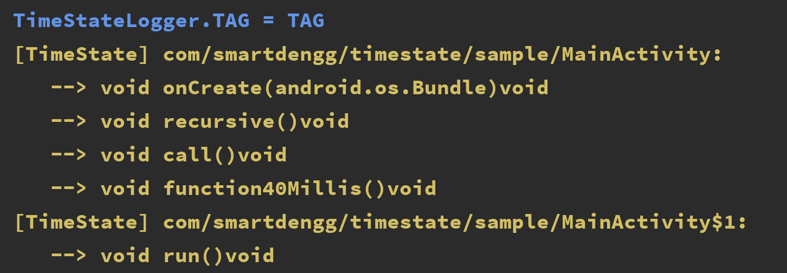
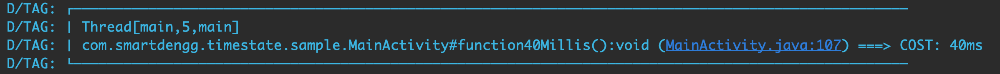
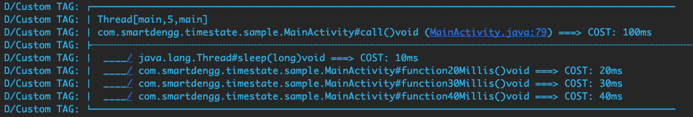

| README.md |
|:---|


time-state
====

在开发环境下，通过声明注解的方式，显示函数耗时的测量工具。

作为开发者，我们应该密切关注程序的性能，函数是我们关注的最小执行单元，因为所有的逻辑都在函数中执行，因此我们经常需要在函数执行的开始和结尾处添加日志打印语句，日志中应该包含所在线程名称，函数描述，行号以及函数耗时等信息，其中行号方便我们定位它的位置，在我看来它应该像下面这样:

```
Thread[main,5,main] ║ com.lianjia.timestate.app.MainActivity#onCreate(android.os.Bundle)void ║ (MainActivity.java:18) ====> COST: 229ms 
```


**我想每一位开发者都不愿意重复写那些日志语句，你要在函数的开始和结尾各写一遍，而且还不能带到上线上版本中，这就意味着，写完它，又删除它。**这算什么？不仅浪费时间，还很危险，因此我们需要简单高效且安全的方式。


这个工具使用字节码重写技术，支持仅添加一个注解 [@TimeState](#jump-time-state) 或 [@FullTimeState](#jump-full-time-state) 在你的函数上，就能够输出格式漂亮的函数耗时信息的功能，


它与 [hugo](https://github.com/JakeWharton/hugo) 的不同之处在于：它不关心函数的参数值和返回值，只专注函数所耗时间，并且 **time-state** 支持增量编译，丝毫不会影响你的编译速度。

*注意:本仓库只提供了基本的字节码修改功能，是一个的 Android gradle plugin，运行时的函数测量和日志答应功能由 [method-time-state-runtime](https://github.com/SmartDengg/method-time-state-runtime) 提供*


安装&使用
----

**1.** 在工程的根 `build.gradle` 中添加 **time-state** Android gradle plugin 的依赖，在 [CHANGELOG](./CHANGELOG.md) 中记录了所有可用版本信息。

```groovy
buildscript {
  repositories {
    google()
    jcenter()
    maven { url 'https://jitpack.io' }
  }
  dependencies {
    classpath 'com.android.tools.build:gradle:3.5.3'
    classpath 'com.github.SmartDengg.method-time-state:plugin:1.0.0'
  }
}
```

**2.** 在 module 的 `build.gradle` 中应用 time-state AGP 。

```groovy
apply plugin: 'com.android.application' // or com.android.library
apply plugin: 'timestate'
```

通过 gradle console 查看本次编译后将对哪些函数进行耗时测量的日志。



通过以下配置禁止 time-state 对字节码进行重写，默认为允许重写。

```groovy
timeStateSetting {
  enable = false
}
```


**3.** 通过代码对日志输出进行配置。

```java
public class MyApplication extends Application {

  @Override protected void attachBaseContext(Context base) {
    super.attachBaseContext(base);
    TimeStateLogger.debuggable = BuildConfig.DEBUG;
    TimeStateLogger.TAG = "Custom TAG";
  }
}
```


<span id="jump-time-state">@TimeState</span>
----

使用 `@TimeState` 打印函数耗时

```java
  @TimeState 
  private void function40Millis() {
    try {
      Thread.sleep(40);
    } catch (InterruptedException e) {
      e.printStackTrace();
    }
  }
```

日志的输出格式如下:



<span id="jump-full-time-state">@FullTimeState</span>
----

如果函数内存在其他函数调用，你可以使用增强的 `@FullTimeState` 打印全量的函数耗时。

```java
  @FullTimeState 
  private void call() {
    try {
      Thread.sleep(10);
    } catch (InterruptedException e) {
      e.printStackTrace();
    }

    function20Millis();
    function30Millis();
    function40Millis();
  }
```

日志结果如下，由上至下打印了 `call()` 函数:



R8 / ProGuard
----

```
# keep everything in this package from being removed or renamed
-keep class com.smartdengg.timestate.runtime.** { *; }

# keep everything in this package from being renamed only
-keepnames class com.smartdengg.timestate.runtime.** { *; }
```

问题&反馈
----

欢迎在 [issue](https://github.com/SmartDengg/method-time-state/issues) 中提交问题或者邮件联系 hi4joker@gmail.com


